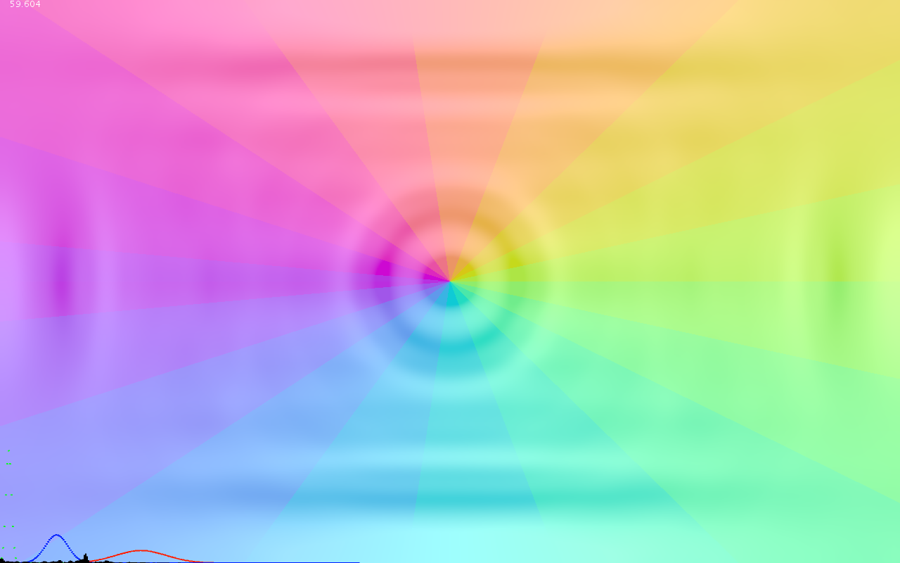
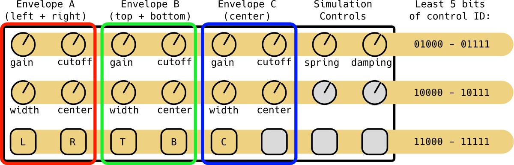

# Marsh Lights

This work was produced in fulfillment of my project obligations as a resident of Marsh, the arts theme house at Amherst College. 

## Overview

Marsh Lights is a composition of three parts: 
  - A surface wave simulator running on the GPU produces **visual output.**
  - A fast Fourier transform (FFT) processes **audio input** and produces amplitude and frequency information to drive the wave simulation.
  - A midi controller provides an interface for **user input** to alter the ways in which audio drives the simulation.
  

There are five "nodes" (top, bottom, left, right, and center) controlled by three independent filters. These nodes, driven by the audio signal, act as regions of disturbance from which waves propagate across the display.

The output of the FFT and configurable filter envelopes (R, G, B) are displayed along the bottom.

## Getting Started

Marsh Lights is implemented as a Processing sketch. The Processing IDE and environment can be downloaded from [Processing.org](https://processing.org/). 

The project also requires the `midibus` and `processing.sound` libraries. These can be installed from within the Processing IDE through the `sketch -> import library -> add library` menu.

Once the requirements are installed, simply clone or download this repository and open `Marsh_Lights.pde` in the Processing IDE. Make sure the name of the directory containing the `.pde` files is also `Marsh_Lights`.

## Input
  
The **user input** portion of the program is designed around a Novation LaunchControl midi device with 16 knobs (trimpots, not rotary encoders) and 8 buttons. Individual control numbers for each knob/button can be set in the LaunchControl's ROM using the provided "Launch Control Editor" software.

In theory, any midi controller can be used as long as inputs are mapped to the control numbers listed in the below diagram:

  - **Buttons** (bottom row) enable/disable the corresponding node.
  - **Gain knobs** control the "amplitude" of the nodes for each envelope, and hence size of produced waves.
  - **Cutoff knobs** control the trigger threshold for nodes. This can help lower the effects of background noise.
  - **Width knobs** control the "sampling width" of each envelope in frequency space.
  - **Center knobs** control the central frequency band of each sample envelope. This allows one set of nodes to react to mids or vocals, for example, and another to react to bass.
  - **Spring** and **Damper** knobs control the constants that determine the behavior of the simulation. Low damping and a high spring constant tend to produce the most interesting visual patterns.

 
## License

This software is released under the MIT license. TL;DR you can do as you please, but I am not liable and it would be nice if you attributed my work.

